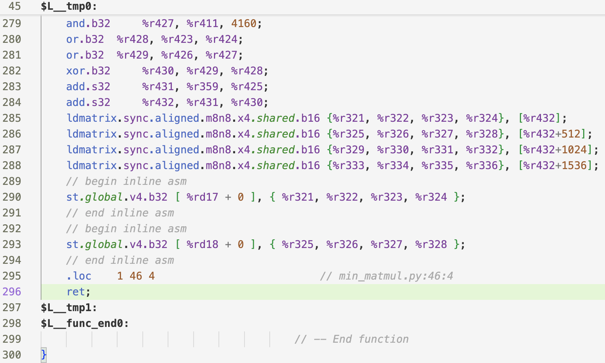

A mini VSCode extension for NV PTX syntax highlighting.

The initial TextMate spec was largely drafted by Claude AI but worked reasonably well for the most part. Only a few things needed a tweak, and the plan
is to go back to amend `./syntaxes/ptx.tmLanguage.json` to add more rules if we find more cases that don't work well.

When making changes, look at the theme's definition to find the "proper" scope to make certain things bold, italic, or display as certain colors: https://github.com/microsoft/vscode/blob/887fc4d185b974b63f19867b5f7800263466dac0/extensions/theme-quietlight/themes/quietlight-color-theme.json#L2

The goal is to have a simplistic helper to assist with eyeballing PTX code, so bear with me if the TextMate spec is abusing scopes a bit (to force italic format for example)

For now, it looks like this (VSCode Quiet Light theme):

## How to install:
- Clone this repo
- Build bundle: `vsce package` (https://code.visualstudio.com/api/working-with-extensions/publishing-extension#vsce)
- Install the built `vsix` bundle: `code --install-extension pchen-mini-ptx-syntax-0.0.1.vsix` or use VSCode UI
